# Power BI Sales Analysis Project

An end-to-end data analytics project focused on transforming raw sales data into actionable business intelligence using Power BI and Power Query.

---

## Repository Structure

* `/Data`: Contains raw source dataset ( Store+Data.xlsx)
* `/Images`: Contains screenshots of Data transformations, DAX measures and Reports.
* `/PowerBI_Reports`: Portable, lightweight Power BI Template file (`.pbit`).
* `/Scripts_PowerQuery_m`: Contains Extracted Power Query M-scripts
* * `/README.md`: Markdown page containing project details.

---

## Data Transformation (ETL)

All data cleaning and preparation steps were completed in *Power Query Editor* to ensure the data was clean and optimized for reporting.

### Key Steps Completed:

* *Data Loading:* Loaded the data into PowerBI desktop and opened power query editor & in view tab under Data preview section, check "column distribution", "column quality" & "column profile" options.Also since by default, profile will be opened only for 1000 rows so you need to select "column profiling based on entire dataset".
Also checked for and checked for error and empty values in dataset.
* *Data Type Fix:* Changed CustomerID from a number to *Text* in both the Customer and Fact tables. Since IDs are relational codes (not numbers to be added or averaged), this prevents errors and improves performance.
*Text Cleaning (Removing Messy Numbers):* The customer email list contained sequential index numbers prepended directly to the email strings (e.g., "1Aarav@gmail.com" up to "50..."). Used *By Digit to Non Digit from split column* to isolate the text pattern, stripping away the numeric prefixes automatically and leaving 100% clean email addresses.
* *Standardizing Text:* The promotion table had text descriptions like "20% off" and "Buy 1 Get 1 Free". Used a *Conditional Column* to turn these into clean numbers (e.g., 20 and 50) under a new Percentage column so they can be used in math equations.

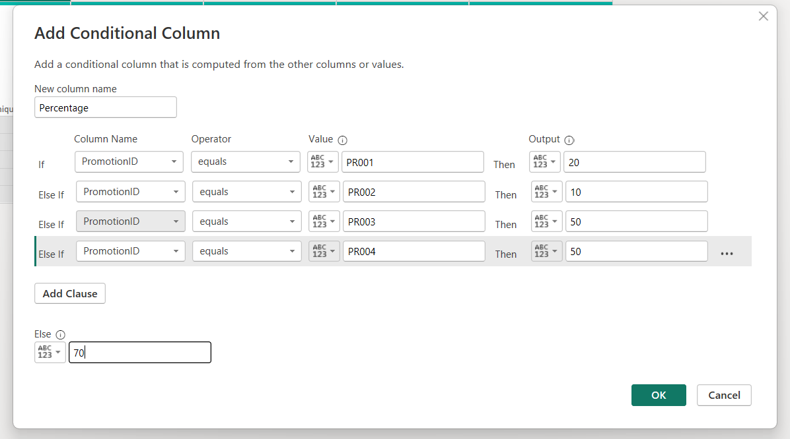

* *Bringing in Price (Left Join):* Merged the Product table into the Fact table using a *Left Outer Join* to bring over the Price Per Unit. A Left Join was used instead of an Inner Join to ensure that no transaction rows are accidentally deleted if a product ID is missing or misspelled in the future.

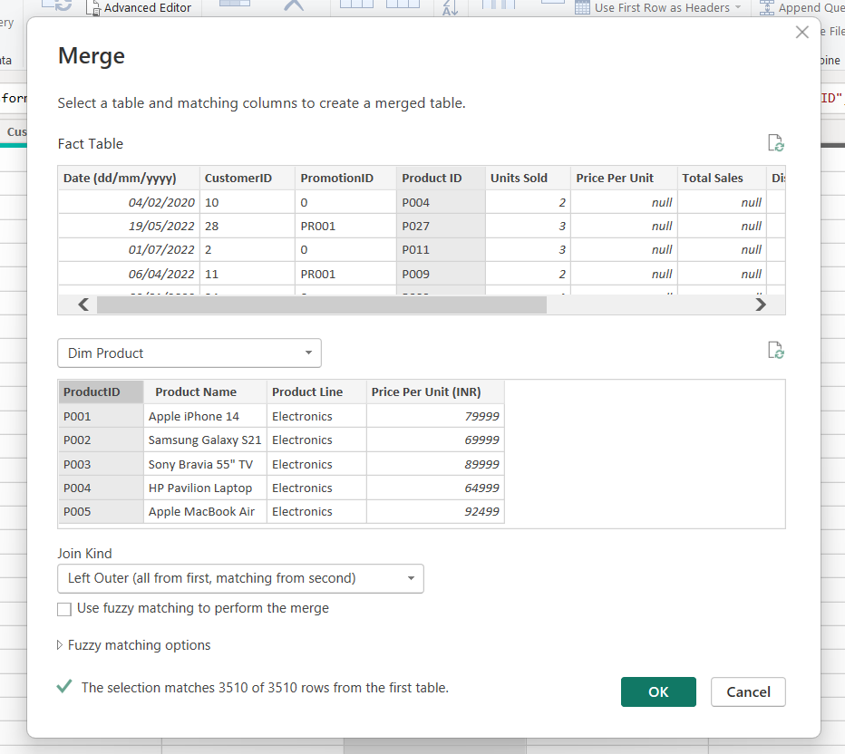

* *Calculating Total Sales:* Added a *Custom Column* to calculate revenue for each row: 
  Total Sales = [Units Sold] * [Price Per Unit]
  Doing this math during the data load keeps the final Power BI report lightweight and fast.

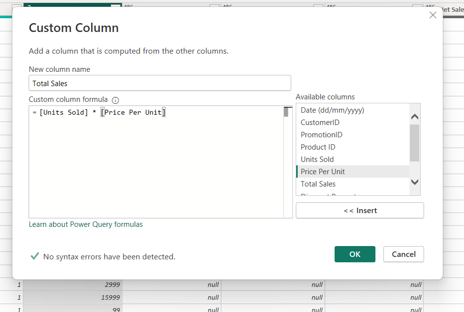

* *Bringing in Discount Percentage (Left Join):* Merged the Promotion table into the Fact table to bring over the Discount Percentage. Transactions that did not use a coupon code showed up as null. I used the *Replace Values* tool to switch these null values to 0. This keeps the data accurate and ready for calculation.

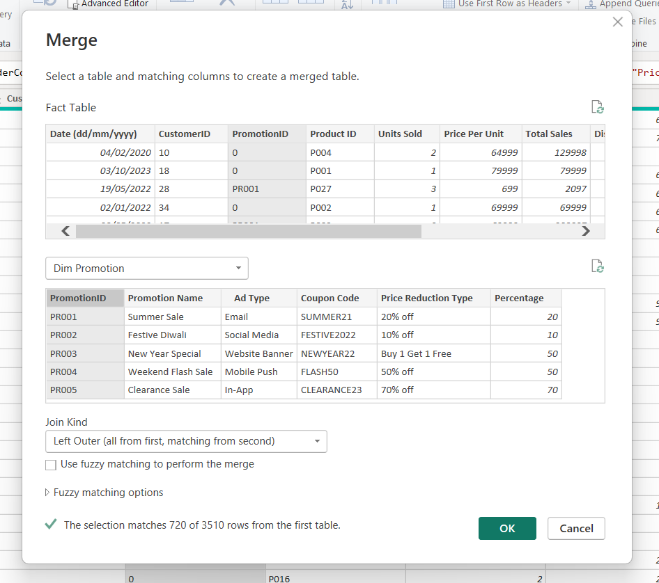

* *Calculating Discount Values:* Added a *Custom Column* to calculate Discount Value 
  Discount = [Total Sales] * ([Discount Percentage]/100)

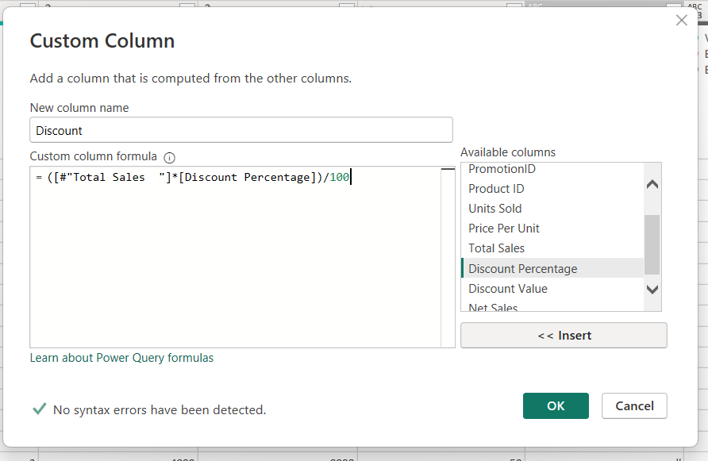

* *Calculating Net Sales:* Added a *Custom Column* to calculate Net Sales: 
  Net Sales = [Total Sales] - [Discount]
  

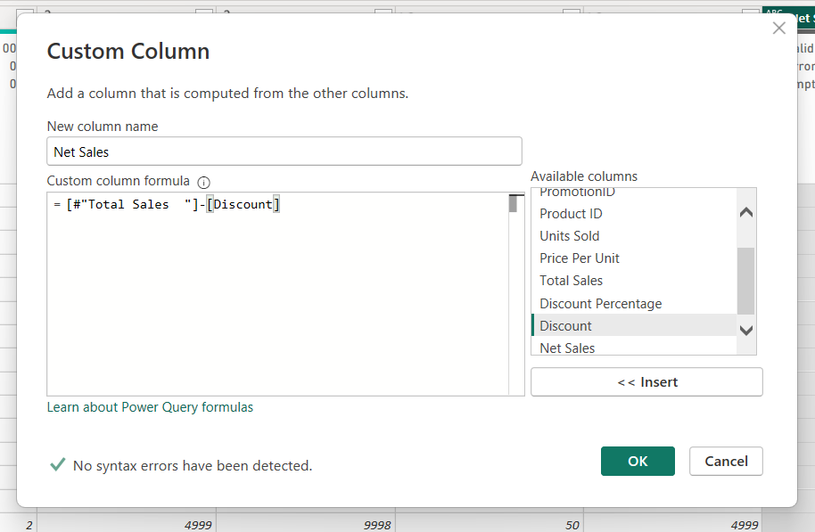

### Data Modelling
After completing the data preparation steps in Power Query, the tables were loaded into Power BI and structured into an optimized *Star Schema* to ensure fast report performance and clear data filtering.

The model consists of a central fact table surrounded by descriptive dimension (lookup) tables:

### 1. Model Components
* *Central Fact Table (Fact Table):* Contains transactional sales data and calculated metrics (Units Sold, Price Per Unit, Total Sales, Discount, and Net Sales).
* *Dimension Tables:* Provide context for analysis:
  * Dim Customers - Customer profiles, location, and clean contact details.
  * Dim Product - Inventory classifications and product details.
  * Dim Promotion - Marketing campaigns and numeric discount percentages.
  * Date Table 1 & Date Table 2 - Calendar tracking periods.

### 2. Relationship Mapping & Enforcements
* *Cardinality:* All lookups connect using standard *1-to-Many (1 -> *)* relationships. Filters flow downward from a single value in the dimension tables to aggregate multiple matching rows in the Fact table.
* *Cross-Filter Direction:* Set strictly to *Single* to maintain clean evaluation pathways and prevent performance-heavy cross-filtering cycles.

### 3. Role-Playing Date Dimensions
To allow flexible chronological filtering across different reporting requirements without creating a cluttered model, two separate date tables were introduced:
* *Active Relationship (Date Table 1):* Acts as the primary calendar link to handle default, automatic time-intelligence reporting across charts.
* *Inactive Relationship (Date Table 2):* Staged as a secondary timeline link. This allows specialized date analysis side-by-side with the primary timeline by activating this connection via DAX formulas using the USERELATIONSHIP function.

## DAX Measures

The model implements a *Role-Playing Dimension* pattern. This allows users to compare business performance across two completely independent time periods side-by-side using separate calendar slicers.

### Date Period 1 Metrics (Active Calendar)
These baseline metrics react automatically to selections made on the primary Date Table 1 slicer:

* *Total Quantity Sold (P1)*
  Total Quantity Sold (P1) = SUM('Fact Table'[Units Sold])

* *Total Net Sales (P1)*
  Total Net Sales (P1) = SUM('Fact Table'[Net Sales])

* *Total Profit (P1)*
  Total Profit (P1) = SUM('Fact Table'[Profit Column])

## Period 2 Metrics (Inactive Calendar)
These advanced metrics use ALL to clear out the primary calendar's filters and temporarily activate the secondary relationship via USERELATIONSHIP to read strictly from Date Table 2:

* *Total Quantity Sold (P2)*
  Total Quantity Sold (P2) = 
CALCULATE(
    SUM('Fact Table'[Units Sold]),
    ALL('Date Table 1'),
    USERELATIONSHIP('Date Table 2'[Date], 'Fact Table'[Date (dd/mm/yyyy)])
)
* *Total Net Sales (P2)*
  Total Net Sales (P2) = 
CALCULATE(
    SUM('Fact Table'[Net Sales]),
    ALL('Date Table 1'),
    USERELATIONSHIP('Date Table 2'[Date], 'Fact Table'[Date (dd/mm/yyyy)])
)
* *Total Profit (P2)*
  Total Profit (P2) = 
CALCULATE(
    SUM('Fact Table'[Profit Column]),
    ALL('Date Table 1'),
    USERELATIONSHIP('Date Table 2'[Date], 'Fact Table'[Date (dd/mm/yyyy)])
)

## Date Table Creation
* Two Independent calendar tables (*Date Table 1* and *Date Table 2*) were generated via DAX to establish a clean star schema design.
  Date Table 1= CALENDARAUTO()

----

### Custom Metric Derivation (Business Assumptions)
Since I am working on a Sales Analysis project I also wanted to know about the profits achieved after sales.Since business profit was not provides I created a profit column using power query editor.
* *Profit Column:* Created via Power Query Custom Column using a standardized baseline assumption of a *10% net profit margin* on all closed transactions.
* *M Formula Utilized:* 
  = 0.1 * [#"Net Sales"]

  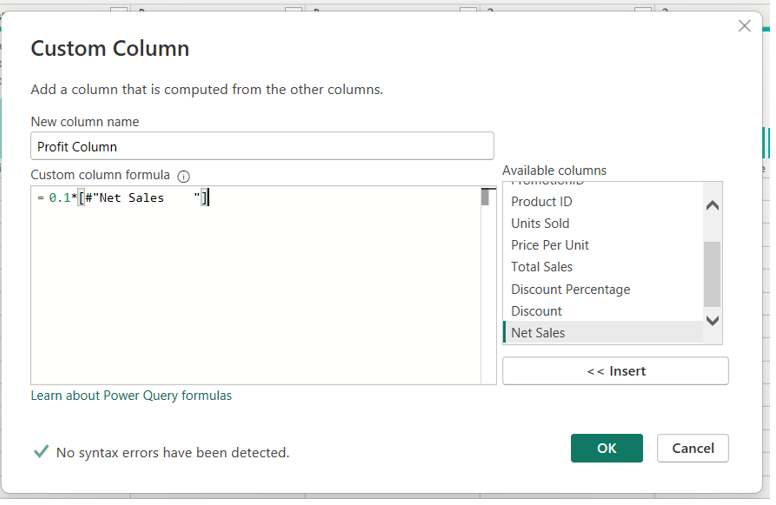

----

## Power BI Reports

* **Top/Bottom Analysis:** A dedicated *Top/Bottom Analysis* dashboard page was created to show the *Top/Bottom 5 products* by Sales/Profit/Quantity sold. The rankings were implemented via PowerBI filters pane *TopN*
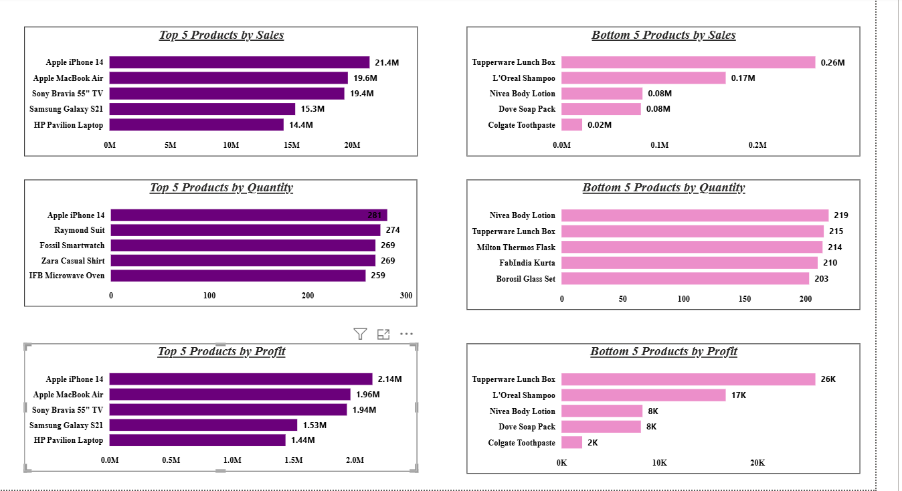

* **Sales/Profitability Analysis:** A *Sales/Profitability Analysis* dashboard was created containing:
* A Scatter chart representing the relationship between *Sales and Profit*.
* A bar chart representing the *Average Discount offered in each discount category*.
* A map visual representing the *Sales in different cities*.
* A card visual representing the *Total Number of orders*.

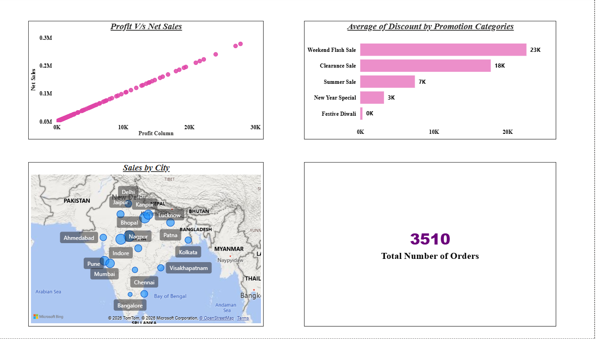

* **Time Period Analysis:** A report showing the comparison of *Sales/Profit/Quantity Sold across two completely independent time periods* side-by-side using separate calendar slicers.

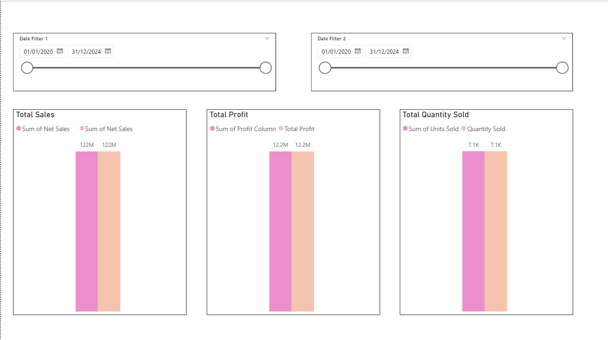

* **Sales Trends Overview:** A report showing the Sales Trends over time.

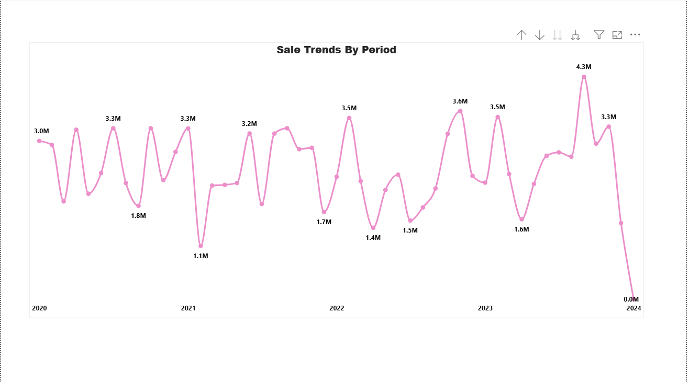